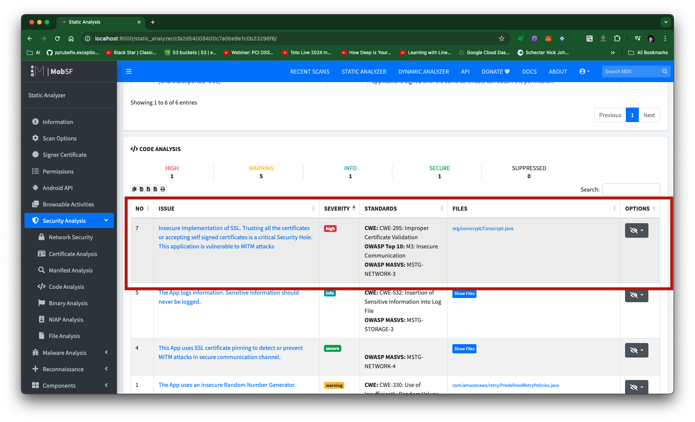

# AWS SDK Android IoT Vulnerability Demo

This project demonstrates a critical vulnerability found in the [AWS IoT SDK for Android](https://github.com/aws-amplify/aws-sdk-android/tree/main/aws-android-sdk-iot) (version 2.77.0), where the SDK insecurely handles SSL certificates, exposing the application to Man-in-the-Middle (MITM) attacks.

## Vulnerability Description

The AWS IoT SDK for Android has an insecure implementation of SSL/TLS. When making secure network requests to AWS IoT endpoints, the SDK does not properly validate SSL certificates, which could allow attackers to intercept and modify data between the application and AWS IoT services.

## MobSF Vulnerability Report

This screenshot shows the SSL vulnerability detected by MobSF:

## Steps to Reproduce

1. Clone this repository.
2. Open the project in Android Studio.
3. Add your AWS IoT endpoint and Cognito identity pool to the `MainActivity`.
4. Build the [APK](./assets/app-debug.apk).
5. Analyze the APK using [Mobile Security Framework (MobSF)](https://github.com/MobSF/Mobile-Security-Framework-MobSF) to confirm the presence of the SSL vulnerability.

## Potential Impact

An insecure SSL implementation makes the application vulnerable to:
- Data interception and manipulation via MITM attacks.
- Exposure of sensitive information transmitted to AWS IoT services.